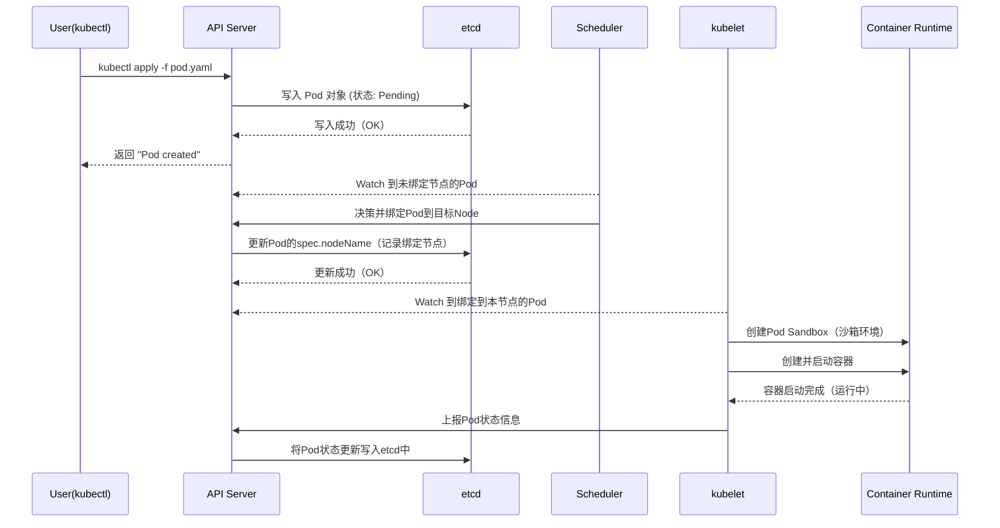
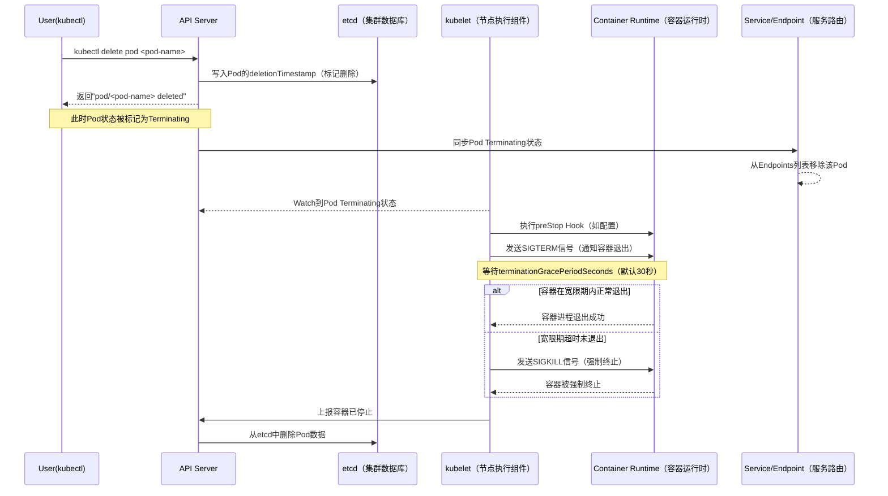

# 3. Pod 入门到实战

**Pod是Kubernetes中最小的可部署和管理单元**。一个Pod包含一个或多个紧密相关的容器（可以把Pod看作一个逻辑上的容器组），这些容器共享：

- **网络命名空间**（共享IP地址和端口空间）
- **存储卷**（共享存储）
- **生命周期**（一起创建、一起调度、一起终止）

## 3.1 Pod 的创建&删除过程

### 3.1.1 创建过程

```bash
对应以下流程：
1. User → API Server → etcd
   创建 Pod 对象（Pending，未绑定节点）

2. Scheduler → API Server → etcd
   发现未绑定 Pod，选择 Node，写入 spec.nodeName

3. kubelet → Runtime
   发现绑定到本节点的 Pod，创建 Pod Sandbox 和容器

4. kubelet → API Server → etcd
   上报 Pod 状态（Running）
```



### 3.1.2 删除过程

```bash
对应流程如下：
1. User → API Server → etcd
   设置 deletionTimestamp，Pod 进入 Terminating

2. Service / Endpoint Controller
   发现 Pod Terminating，从 Endpoints 中移除

3. kubelet → Runtime
   执行 preStop（如有），发送 SIGTERM

4. kubelet → Runtime
   等待 terminationGracePeriodSeconds，必要时发送 SIGKILL

5. kubelet → API Server → etcd
   清理完成，删除 Pod 对象
```





## 3.2 Pod 的状态

|             状态              |                             说明                             |
| :---------------------------: | :----------------------------------------------------------: |
|        Pending（挂起）        | Pod 已被 Kubernetes 系统接收，但仍有一个或多个容器未被创建，可以通过**kubectl describe**查看处于 Pending 状态的原因 |
|       Running（运行中）       | Pod 已经被绑定到一个节点上，并且所有的容器都已经被创建，而且至少有一个是运行状态，或者是正在启动或者重启，可以通过**kubectl logs**查看 Pod 的日志 |
|       Succeeded（成功）       | 所有容器执行成功并终止，并且不会再次重启，可以通过**kubectl logs**查看 Pod 日志 |
|     Failed/Error（失败）      | 所有容器都已终止，并且至少有一个容器以失败的方式终止，也就是说这个容器要么以非零状态退出，要么被系统终止，可以通过**logs**和**describe**查看 Pod 日志和状态 |
|        Unknown（未知）        |         通常是由于通信问题造成的无法获得 Pod 的状态          |
| ImagePullBackOff/ErrImagePull | 镜像拉取失败，一般是由于镜像不存在、网络不通或者需要登录认证引起的，可以使用**describe**命令查看具体原因 |
|       CrashLoopBackOff        | 容器启动失败，可以通过**logs**命令查看具体原因，一般为启动命令不正确，健康检查不通过等 |
|           OOMKilled           | 容器内存溢出，一般是容器的内存 Limit 设置的过小，或者程序本身有内存溢出，可以通过**logs**查看程序启动日志 |
|          Terminating          |         Pod 正在被删除，可以通过**describe**查看状态         |
|        SysctlForbidden        | Pod 自定义了内核配置，但 kubelet 没有添加内核配置或配置的内核参数不支持，可以通过**describe**查看具体原因 |
|           Completed           | 容器内部主进程退出，一般计划任务执行结束会显示该状态，此时可以通过**logs**查看容器日志 |
|       ContainerCreating       | Pod 正在创建，一般为正在下载镜像，或者有配置不当的地方，可以通过**describe**查看具体原因 |

## 3.3 一个 Pod 多容器

一般都是一个Pod对应一个容器，如果要运行多个容器的话，就在containers字段下添加多个容器的name和image就行了。

```bash
[root@master 12.22]# cat 2.pod.yaml 
apiVersion: v1    # 必选，API 的版本号
kind: Pod         # 必选，类型 Pod
metadata:         # 必选，元数据
  labels:         # 选填，资源标签
    run: nginx
  name: test-pod2 # 必选，符合 RFC 1035 规范的 Pod 名称
  namespace: default # 选填，名称空间（默认default）
spec:             # 必选，用于定义 Pod 的详细信息
  containers:     # 必选，容器列表
  - image: crpi-j2guy08w46nav7rf.cn-hongkong.personal.cr.aliyuncs.com/xiao_he/nginx:1.27.5 # 必选，容器所用的镜像的地址
    name: nginx   # 必选，符合 RFC 1035 规范的容器名称
    ports:        # 选填，容器需要暴露的端口号列表
    - containerPort: 80
      name: web
  - image: crpi-j2guy08w46nav7rf.cn-hongkong.personal.cr.aliyuncs.com/xiao_he/redis:v7.0.5
    name: redis
    ports: 
    - containerPort: 6379
      name: redis
      protocol: TCP
[root@master 12.22]# kubectl apply -f 2.pod.yaml 
pod/test-pod2 created
[root@master 12.22]# kubectl get pods 
NAME        READY   STATUS    RESTARTS   AGE
test-pod2   2/2     Running   0          5s
```

## 3.4 Pod 的启动命令和参数

**command** (容器启动命令)

- 对应 Docker 镜像的 `ENTRYPOINT`
- 数组格式，每个元素是一个命令或参数
- 例如：`["/bin/sh", "-c"]`

**args** (传递给命令的参数)

- 对应 Docker 镜像的 `CMD`
- 可以数组格式或字符串格式
- 例如：`["echo", "hello"]` 或 多行字符串

在 K8s 中：

- **只设置 `command`**：覆盖 `ENTRYPOINT`，使用镜像默认的 `CMD`
- **只设置 `args`**：使用镜像的 `ENTRYPOINT`，但覆盖 `CMD`
- **同时设置两者**：完全覆盖镜像的启动配置

```bash
[root@master 12.22]# kubectl run test-alpine --image=crpi-j2guy08w46nav7rf.cn-hongkong.personal.cr.aliyuncs.com/xiao_he/alpine:3.20
pod/test-alpine created

[root@master 12.22]# docker history alpine:3.20 
IMAGE          CREATED         CREATED BY                                       SIZE      COMMENT
ff221270b9fb   10 months ago   CMD ["/bin/sh"]                                  0B        buildkit.dockerfile.v0
<missing>      10 months ago   ADD alpine-minirootfs-3.20.6-x86_64.tar.gz /…   7.8MB     buildkit.dockerfile.v0

# alpine这镜像是执行一个/bin/sh命令就退出了，所以pod的状态是completed。
[root@master 12.22]# kubectl get pods
NAME          READY   STATUS      RESTARTS      AGE
test-alpine   0/1     Completed   2 (18s ago)   21s
```

这个时候我们在Pod的yaml修改一下该镜像的启动命令，来让它变为Running

```bash
[root@master 12.22]# cat 3.pod_command_args.yaml 
apiVersion: v1
kind: Pod
metadata: 
  name: command-args
spec: 
  containers: 
  - name: command-args
    image: crpi-j2guy08w46nav7rf.cn-hongkong.personal.cr.aliyuncs.com/xiao_he/alpine:3.20
    command: ["/bin/sh","-c"]
    args: 
    - | 
            echo "Hello World!"
            tail -f /dev/null 

[root@master 12.22]# kubectl apply -f 3.pod_command_args.yaml 

# 因为启动的参数是tail -f /dev/null 所以alpine镜像是running
[root@master 12.22]# kubectl get pods
NAME           READY   STATUS             RESTARTS        AGE
command-args   1/1     Running            0               5s
[root@master 12.22]# kubectl logs command-args 
Hello World!
# 通过ps命令可以查看到，我们把该镜像的启动命令和启动参数改掉了
[root@master 12.22]# kubectl exec -it command-args -- ps
PID   USER     TIME  COMMAND
    1 root      0:00 /bin/sh -c echo "Hello World!" tail -f /dev/null 
    7 root      0:00 tail -f /dev/null
    8 root      0:00 ps
```

## 3.5 requests & limits

requests 是 Pod/容器对资源的「最小需求申请」，决定调度；limits 是「资源使用上限」，限制资源过度占用。两者共同配合实现 K8s 集群的资源合理分配、避免资源争抢，同时关联 QoS（服务质量等级），影响 Pod 的调度优先级和驱逐策略。

### 3.5.1 requests 资源最小需求申请

定义：容器运行所需的「最低资源保障」，K8s 调度器（kube-scheduler）会根据 requests 的值，将 Pod 调度到「拥有足够空闲资源」的节点上。

关键特性：

- 调度依据：节点的空闲资源（节点总资源 - 已分配给其他 Pod 的 requests 资源）必须 ≥ 当前 Pod 所有容器的 requests 总和，否则 Pod 会处于 Pending 状态，无法调度。
- 资源保障：K8s 会尽力确保容器获得 requests 声明的资源量，避免因节点资源不足导致容器无法正常运行。
- 超用可能：容器实际使用的资源可以超过 requests（除非达到 limits 上限），比如节点有空闲 CPU 时，容器可使用更多 CPU 资源。

### 3.5.2 limits 资源使用上限

定义：容器运行时允许使用的「最大资源额度」，用于限制容器过度占用资源，避免单个容器消耗过多资源影响节点上其他 Pod 或节点本身的稳定性。

关键特性：

- CPU 限制：若容器 CPU 使用超过 limits，K8s 会通过 `cgroups cpu.shares` 机制「限制 CPU 使用率」（节流，throttling），不会杀死容器，仅限制其 CPU 分配。
- 内存限制：若容器内存使用超过 limits，K8s 会触发 OOM（Out Of Memory）杀死容器（对应容器状态 OOMKilled），随后根据 Pod 的重启策略决定是否重启。
- 上限约束：==limits 的值必须 ≥ 对应的 requests 值==（否则会报配置错误），因为「最大上限不能低于最小需求」。

### 3.5.3 调度机制

K8s 调度器的核心逻辑之一是「资源适配」，流程如下：

1. 计算当前 Pod 所有容器的 requests.cpu 总和（记为 total_cpu_req）和 requests.memory 总和（total_mem_req）。
2. 遍历集群中所有节点，过滤掉「资源不足」的节点：节点的空闲 CPU = 节点总 CPU - 已分配 CPU requests；空闲内存 = 节点总内存 - 已分配内存 requests。若节点空闲 CPU ≥ total_cpu_req 且空闲内存 ≥ total_mem_req，则该节点为「可调度节点」。
3. 从可调度节点中，结合其他调度策略（如节点亲和性、污点容忍等）选择最优节点，将 Pod 调度到该节点。

### 3.5.4 注意事项

- **可只配置 requests 或 limits 吗？**
  1. 只配置 requests：无资源上限，容器可能无限制占用节点资源（不推荐，易导致资源争抢）
  2. 只配置 limits：K8s 会默认将 requests 设为与 limits 相等（等价于 Guaranteed 级别的 QoS）
  3. 都不配置：容器可使用节点剩余资源（BestEffort 级 QoS，调度优先级最低，易被驱逐）。
- **资源配置是容器级别的：**Pod 有多个容器时，需为每个容器单独配置，Pod 的总资源需求 = 所有容器 requests 之和，总资源上限 = 所有容器 limits 之和。

> [!CAUTION]
>
> 关键提醒：==调度器只关注 requests，不关注 limits！只要节点空闲资源满足 requests，无论 limits 多大，都可能被调度（但运行时会被 limits 限制）。==

### 3.5.5 示例

```bash
[root@master 12.22]# cat 4.pod_resources.yaml 
apiVersion: v1
kind: Pod
metadata:
  name: pod-resources
spec:
  containers:
  - image: crpi-j2guy08w46nav7rf.cn-hongkong.personal.cr.aliyuncs.com/xiao_he/nginx:1.27.5
    name: nginx
    resources: 
      requests:       # 最小资源需求
        cpu: 1        # 1 CPU核心（1000m）
        memory: 1Gi   # 1024MB内存
      limits:         # 资源使用上限
        cpu: 8        # 8 CPU核心（我的每个节点都是2个CPU）
        memory: 6Gi   # 512MB内存（我的每个节点都是4G的内存）
[root@master 12.22]# kubectl apply -f 4.pod_resources.yaml 
# 被调度到了node01节点
[root@master 12.22]# kubectl get pods -owide
NAME             READY   STATUS    RESTARTS   AGE   IP               NodE     NOMINATED NodE   READINESS GATES
pod-resources    1/1     Running   0          23s   172.16.196.176   node01   <none>           <none>
```

执行 `kubectl describe nodes node01`，看最后面的Allocated resources


这个时候，我再创建一个带有容器资源配置的pod

```bash
[root@master 12.22]# cat 5.pod_resources.yaml 
......
spec:
  containers:
  - image: crpi-j2guy08w46nav7rf.cn-hongkong.personal.cr.aliyuncs.com/xiao_he/nginx:1.27.5
    name: nginx
    resources: 
      requests: 
        cpu: 1
        memory: 1Gi
      limits: 
        cpu: 8
        memory: 6Gi
[root@master 12.22]# kubectl apply -f 5.pod_resources.yaml 
# 因为我们有两个work节点，然后node01节点的requests还有660m可用，显然是不满足我们的最小资源量的，所以就被调度到了node02节点
[root@master 12.22]# kubectl get pods -owide
NAME             READY   STATUS    RESTARTS   AGE   IP               NodE     NOMINATED NodE   READINESS GATES
pod-resources    1/1     Running   0          23m   172.16.196.176   node01   <none>           <none>
pod-resources2   1/1     Running   0          9s    172.16.140.112   node02   <none>           <none>
```

执行 `kubectl describe nodes node02`，看最后面的Allocated resources


这个时候我们再创建一个pod

```bash
[root@master 12.22]# cat 6.pod_resources.yaml 
......
spec:
  containers:
  - image: crpi-j2guy08w46nav7rf.cn-hongkong.personal.cr.aliyuncs.com/xiao_he/nginx:1.27.5
    name: nginx
    resources: 
      requests: 
        cpu: 1
        memory: 1Gi
      limits: 
        cpu: 8
        memory: 6Gi
[root@master 12.22]# kubectl apply -f 6.pod_resources.yaml 
# 因为没有节点满足需求了，所以是pending的状态
[root@master 12.22]# kubectl get pods -owide
NAME             READY   STATUS    RESTARTS   AGE     IP               NodE     NOMINATED NodE   READINESS GATES
pod-resources    1/1     Running   0          31m     172.16.196.176   node01   <none>           <none>
pod-resources2   1/1     Running   0          7m55s   172.16.140.112   node02   <none>           <none>
pod-resources3   0/1     Pending   0          11s     <none>           <none>   <none>           <none>
```

执行`kubectl describe pods pod-resources3 | grep -i -A10 events`查看报错原因，报错说可有的2个节点的cpu不足


## 3.6 Pod 的环境变量&内置变量

可以先通过explain来查看都有哪些字段可以配置，再看看每个字段对应的类型

```bash
[root@master 12.22]# kubectl explain pod.spec.containers.env
```

**K8s 内置环境变量（原生提供，可直接引用）**

```bash
# 需要在spec.containers[].env[].valueFrom.fieldRef.fieldPath字段下引用
metadata.name
metadata.namespace
metadata.uid
metadata.labels[xxx]
metadata.annotations[xxx]
spec.nodeName
spec.serviceAccountName
status.hostIP
status.hostIPs
status.podIP
status.podIPs
```

```bash
[root@master 12.22]# cat 9.pod_env.yaml 
apiVersion: v1
kind: Pod
metadata:
  labels: 
    app: java
  name: pod-env
  namespace: default
spec:
  containers:
  - image: crpi-j2guy08w46nav7rf.cn-hongkong.personal.cr.aliyuncs.com/xiao_he/nginx:1.27.5
    name: nginx
    env: 
    - value: lili   # 创建环境变量
      name: haha
    - name: app     # 调用内置的环境变量，动态的获取pod的标签
      valueFrom: 
        fieldRef: 
          fieldPath: metadata.labels['app']
    - name: Pod_IP  # 调用内置的环境变量，动态的获取pod的IP地址
      valueFrom: 
        fieldRef: 
          fieldPath: status.podIP
    - name: HOST_IP # 调用内置的环境变量，动态的获取该节点的IP地址
      valueFrom: 
        fieldRef: 
          fieldPath: status.hostIP
[root@master 12.22]# kubectl apply -f  9.pod_env.yaml 
[root@master 12.22]# kubectl exec -it pod-env -- env
PATH=/usr/local/sbin:/usr/local/bin:/usr/sbin:/usr/bin:/sbin:/bin
HOSTNAME=pod-env
NGINX_VERSION=1.27.5
PKG_RELEASE=1
DYNPKG_RELEASE=1
NJS_VERSION=0.8.10
NJS_RELEASE=1
HOST_IP=192.168.10.81  # 动态的获取到了该节点的IP了
haha=lili   # 创建了
app=java    # 动态的获取到了pod的标签的值了
Pod_IP=172.16.196.177  # 动态的获取到了pod的IP了
NGINX_SERVICE_PORT=80
NGINX_PORT=tcp://10.98.43.34:80
NGINX_PORT_80_TCP=tcp://10.98.43.34:80
NGINX_PORT_80_TCP_PROTO=tcp
KUBERNETES_SERVICE_HOST=10.96.0.1
KUBERNETES_PORT_443_TCP_PORT=443
NGINX_PORT_80_TCP_PORT=80
KUBERNETES_PORT=tcp://10.96.0.1:443
NGINX_SERVICE_HOST=10.98.43.34
KUBERNETES_PORT_443_TCP_ADDR=10.96.0.1
KUBERNETES_SERVICE_PORT_HTTPS=443
KUBERNETES_PORT_443_TCP_PROTO=tcp
NGINX_PORT_80_TCP_ADDR=10.98.43.34
KUBERNETES_SERVICE_PORT=443
KUBERNETES_PORT_443_TCP=tcp://10.96.0.1:443
TERM=xterm
HOME=/root
```

## 3.7 Pod 的镜像拉取策略

通过 `spec.containers[].imagePullPolicy` 字段可以指定该容器的镜像拉取策略
目前支持的策略如下：

|             拉取策略             |                     核心逻辑                      |           启动失败状态           |
| :------------------------------: | :-----------------------------------------------: | :------------------------------: |
|        Always（始终拉取）        | 每次启动 Pod 均强制拉取最新镜像，无论本地是否存在 |         ImagePullBackOff         |
| IfNotPresent（本地不存在时拉取） |   本地存在镜像则直接使用，不存在时才从仓库拉取    |         ImagePullBackOff         |
|        Never（从不拉取）         |          仅使用本地镜像，绝不从仓库拉取           | ErrImagePull 或 ImagePullBackOff |


**默认拉取策略（自动匹配规则）**

若未在 Pod 清单中配置 `imagePullPolicy`，K8s 会根据镜像标签自动匹配默认策略，无需手动配置：

- 镜像标签为 `latest`：默认策略为 `Always`（强制拉取最新镜像）
- 镜像无标签（仅指定镜像名）：等价于标签为 `latest`，默认策略为 `Always`
- 镜像标签为非 `latest` 的固定标签（如 `v1.0`、`stable`）：默认策略为 `IfNotPresent`（本地存在则直接使用，不存在时则去仓库拉取）

### 3.7.1 Always 示例

```bash
[root@master 12.23]# cat 1.imagePullPolicy_Always.yaml 
apiVersion: v1
kind: Pod
metadata:
  labels:
    run: always
  name: always
spec:
  containers:
  # 以下的镜像每个节点本地都是有的
  - image: crpi-j2guy08w46nav7rf.cn-hongkong.personal.cr.aliyuncs.com/xiao_he/nginx:1.27.5
    name: always
    imagePullPolicy: Always
[root@master 12.23]# kubectl apply -f 1.imagePullPolicy_Always.yaml 
```

执行`kubectl describe pods always`查看最后的事件，会发现它去我的镜像仓库去拉镜像去了，拉取完再创建的。

这里就验证了Always是强制去仓库拉取镜像的


### 3.7.2 IfNotPresent 示例

```bash
# 用一个每个节点都有的镜像来创建pod
[root@master 12.23]# kubectl run test-imagepolicy --image=crpi-j2guy08w46nav7rf.cn-hongkong.personal.cr.aliyuncs.com/xiao_he/nginx:1.27.5 
```

执行`kubectl describe pods test-imagepolicy`查看最后的事件，显示该镜像也在节点存在，然后就基于该节点已存在的镜像来创建pod了，正好验证了镜像标签为非 `latest` 的固定标签（如 `v1.0`、`stable`）：默认策略为 `IfNotPresent`（==本地存在镜像则直接使用==）


那么我再创建一个每个节点都没有的镜像

```bash
[root@master 12.23]# kubectl run test-imagepolicy2 --image=crpi-j2guy08w46nav7rf.cn-hongkong.personal.cr.aliyuncs.com/xiao_he/alpine:3.20
```

执行`kubectl describe pods test-imagepolicy2`查看最后的事件，会发现是去仓库拉取镜像去了。

这里验证了当镜像tag为非`latest`时，会默认使用`IfNotPresent`策略（==本地没有该镜像的话就去仓库拉取==）


> [!TIP]
>
> 推荐显式指定 IfNotPresent 策略：即使镜像标签为非 latest（默认触发 IfNotPresent），也建议显式配置 `imagePullPolicy: IfNotPresent`。原因：一是提升配置可读性，避免他人查看清单时需回忆默认规则；二是防止后续标签变更（如误改为 latest）引发策略意外切换；三是增强配置稳定性，适配 K8s 版本迭代可能的默认规则调整，尤其符合生产环境严谨性要求。

### 3.7.3 Never 示例

使用`--image-pull-policy=Never`来指定策略，以下的镜像是每个节点都有的

```bash
[root@master 12.23]# kubectl run test-imagepolicy3 --image=crpi-j2guy08w46nav7rf.cn-hongkong.personal.cr.aliyuncs.com/xiao_he/nginx:1.27.5 --image-pull-policy=Never
```

执行`kubectl describe pods test-imagepolicy3`查看最后的事件，显示该镜像也在节点存在，然后就基于该节点已存在的镜像来创建pod了

验证了Never策略的如果该节点有该镜像，那么就直接创建


使用一个每个节点本地都没有的镜像来创建pod

```bash
[root@master 12.23]# kubectl run test-imagepolicy4 --image=crpi-j2guy08w46nav7rf.cn-hongkong.personal.cr.aliyuncs.com/xiao_he/mysql:8.0.16   --image-pull-policy=Never
```

执行`kubectl describe pods test-imagepolicy4`查看最后的事件，显示该容器镜像没有按照Never策略处理，意思就是说该镜像本地没有，所以它没有办法拉取镜像（==因为它的策略是仅使用本地镜像，绝不从仓库拉取==）


## 3.8 Pod 的重启策略

Pod 重启策略（restartPolicy）指定容器退出后，K8s 是否重启该容器，配置在 `spec.restartPolicy` 字段，对 Pod 内所有容器生效（仅在当前节点本地重启，不会调度到其他节点），是 Pod 级别的配置。

**三种核心重启策略**

- **Always（默认）**：无论容器因何种原因退出（成功/失败），均自动重启。适用场景：长期运行的服务（如 Nginx、数据库），需保障持续可用。
- **OnFailure**：仅当容器异常退出（退出码非 0）时才重启；正常退出（退出码 0）不重启。适用场景：一次性任务（如数据备份、脚本执行），仅需在失败时重试。
- **Never**：无论容器退出原因，均不重启。适用场景：测试任务、临时调试 Pod，无需自动恢复。

**与控制器协同**：

- **Deployment/StatefulSet**：通常使用`Always`，确保应用持续运行。
- **Job**：通常使用`OnFailure`，任务失败时自动重试。
- **CronJob**：根据需求选择`OnFailure`或`Never`。

### 3.8.1 Always 示例

总是会重启

```bash
[root@master 12.23]# cat 3.restartPolicy.yaml 
apiVersion: v1
kind: Pod
metadata:
  creationTimestamp: null
  labels:
    run: test-restartpolicy1
  name: test-restartpolicy1
spec:
  containers:
  - image: crpi-j2guy08w46nav7rf.cn-hongkong.personal.cr.aliyuncs.com/xiao_he/nginx:1.27.5
    name: test-restartpolicy1
    command: ["/bin/sh","-c"]
    args: 
    - | 
      seeep 6 # 故意写错，让pod起不来
  restartPolicy: Always # 配置策略为Always，就算pod起不来也会一直重启

[root@master 12.23]# kubectl apply -f 3.restartPolicy.yaml 
# 会发现pod一直在重启，现在已经重启了10次了
[root@master 12.23]# kubectl get pods test-restartpolicy1
NAME                  READY   STATUS             RESTARTS       AGE
test-restartpolicy1   0/1     CrashLoopBackOff   10 (21s ago)   26m
```

### 3.8.2 OnFailure示例

退出码为0，不会重启，非0才会重启

```bash
[root@master 12.23]# cat 4.restartPolicy.yaml 
apiVersion: v1
kind: Pod
metadata:
  name: restartpolicy-onfailure
spec:
  containers:
  - image: crpi-j2guy08w46nav7rf.cn-hongkong.personal.cr.aliyuncs.com/xiao_he/nginx:1.27.5
    name: test
    command: ["/bin/sh","-c"]
    args: 
      - |
          echo "Hello World!"
          sleep 3
          exit 0
  restartPolicy: OnFailure# 只有退出码为非0才会重启，所以该pod不会重启
  
[root@master 12.23]# kubectl apply -f 4.restartPolicy.yaml 

# 等了半年后，它也没有重启，这种比较适合和Job、CornJob来配合使用。
[root@master 12.23]# kubectl get pods restartpolicy-onfailure 
NAME                      READY   STATUS      RESTARTS   AGE
restartpolicy-onfailure   0/1     Completed   0          10m38s
```

如果退出码为非0，才会重启

```bash
[root@master 12.23]# cat 5.restartPolicy.yaml 
apiVersion: v1
kind: Pod
metadata:
  name: restartpolicy-onfailure2
spec:
  containers:
  - image: crpi-j2guy08w46nav7rf.cn-hongkong.personal.cr.aliyuncs.com/xiao_he/nginx:1.27.5
    name: test
    command: ["/bin/sh","-c"]
    args: 
      - |
          echo "Hello World!"
          sleep 3
          exit 1
  restartPolicy: OnFailure# 只有退出码为非0才会重启，所以该pod会重启
[root@master 12.23]# kubectl apply -f 5.restartPolicy.yaml
# Pod会不断的重启
[root@master 12.23]# kubectl get pods restartpolicy-onfailure2
NAME                       READY   STATUS   RESTARTS      AGE
restartpolicy-onfailure2   0/1     Error    4 (69s ago)   2m2s
```

### 3.8.3 Never 示例

不管容器是什么退出原因，都不会重启

```bash
[root@master 12.23]# cat 6.restartPolicy.yaml 
apiVersion: v1
kind: Pod
metadata:
  name: restartpolicy-never
spec:
  containers:
  - image: crpi-j2guy08w46nav7rf.cn-hongkong.personal.cr.aliyuncs.com/xiao_he/nginx:1.27.5
    name: test
    command: ["/bin/sh","-c"]
    args: 
      - |
          echo "Hello World!"
          sleep 3
          exit 0
  restartPolicy: Never

[root@master 12.23]# cat 7.restartPolicy.yaml 
apiVersion: v1
kind: Pod
metadata:
  name: restartpolicy-never2
spec:
  containers:
  - image: crpi-j2guy08w46nav7rf.cn-hongkong.personal.cr.aliyuncs.com/xiao_he/nginx:1.27.5
    name: test
    command: ["/bin/sh","-c"]
    args: 
      - |
          echo "Hello World!"
          sleep 3
          exit 1
  restartPolicy: Never
[root@master 12.23]# kubectl apply -f 7.restartPolicy.yaml -f 6.restartPolicy.yaml

# 会发现无论是怎么退出的，都没有重启
[root@master 12.23]# kubectl get pods restartpolicy-never2
NAME                   READY   STATUS   RESTARTS   AGE
restartpolicy-never2   0/1     Error    0          97s
[root@master 12.23]# kubectl get pods restartpolicy-never
NAME                  READY   STATUS      RESTARTS   AGE
restartpolicy-never   0/1     Completed   0          2m19s
```

## 3.9 Pod 的生命周期

==Pod 对象从创建到终止的这段时间范围被称为生命周期==

**生命周期中能做什么**

- 必须操作：启动运行 main（主）容器

- 可选操作：设置容器的初始化方法：（InitContainer）

- 可选操作：配置容器探针：启动探测（startupProbe）、生命探测（IivenessProbe）、就绪探测（readinessProbe）

- 可选操作：添加事件处理函数：启动后回调（PostStart）、结束前回调（PreStop）


### 3.9.1 Pod 生命周期中的5个Phase（阶段）

Pod 的阶段（Phase）是 Pod 在整个生命周期中所处位置的简单宏观概述（高级状态阶段）， 它是一个枚举值，表示 Pod 的整体进度。
可以使用`kubectl get po always -o yaml | grep phase`来查看pod当前阶段

|     阶段名称      |                             描述                             |
| :---------------: | :----------------------------------------------------------: |
|  Pending（挂起）  | Pod已被K8s集群接受，但尚未完成节点调度，或正在拉取容器镜像，此时未启动任何容器 |
| Running（运行中） | Pod 已成功绑定至目标节点，所有容器均创建完成，且至少有一个容器处于运行中、启动中或重启状态 |
| Succeeded（成功） | Pod 内所有容器均已成功终止，且 K8s 不会自动重启这些容器（常见于一次性任务 Pod） |
|  Failed（失败）   | Pod 内所有容器均已终止，且至少有一个容器以非零退出码终止（程序异常）或被系统强制终止，且未配置自动重启策略 |
|  Unknown（未知）  | K8s 无法获取 Pod 的运行状态，通常因 Kubelet 与 API Server 通信中断（如节点故障、网络异常）导致 |


### 3.9.2 Pod Condition（状态）

Phase可以看成是Pod在经历某些调度和操作之后的结果，因此从Phase上我们是看不出来Pod经历了哪些操作或者异常，而condition字段向我们展示了这个细节信息。Pod的conditions告诉我们Pod从创建之初，具体经历过哪些阶段，以及如果出现异常，具体是什么原因造成的。

可以使用`kubectl explain pod.status.conditions`命令来查看都有哪些字段


|      字段名称      |                             描述                             |
| :----------------: | :----------------------------------------------------------: |
|        type        | Pod 状况的名称如（如 `Ready`、`PodScheduled`、`ContainersReady` 等） |
|       status       | 表明该状况是否适用，可能的取值有 "`True`"、"`False`" 或 "`Unknown`" |
|   lastProbeTime    |                 上次探测 Pod 状况时的时间戳                  |
| lastTransitionTime |         Pod 上次从一种状态转换到另一种状态时的时间戳         |
|       reason       | 机器可读的、驼峰编码（UpperCamelCase）的文字，表述上次状况变化的原因 |
|      message       |          人类可读的消息，给出上次状态转换的详细信息          |

我们可以使用`kubectl describe pod`来查看pod生命周期中的==健康检测清单==


**核心字段的概述如下：**

|           type            |                            status                            |
| :-----------------------: | :----------------------------------------------------------: |
| PodReadyToStartContainers | Pod 沙箱被成功创建并且配置了网络（Beta 特性，[默认](https://kubernetes.io/zh-cn/docs/concepts/workloads/pods/pod-lifecycle/#pod-has-network)启用） |
|       PodScheduled        |             表示Pod是否被成功的调度到工作节点上              |
|        Initialized        |            Pod中所有的初始化容器都成功的完成执行             |
|      ContainersReady      |                   Pod中所有容器都已经Ready                   |
|           Ready           |     Pod准备好对外提供服务，所有容器实例都报告状态为Ready     |

也可以使用 `kubectl get pods -oyaml`来查看`pod.status.conditions`字段


每个condition类型在Pod的声明周期中有满足或者不满足两个状态，如下图所示，在Pod刚开始启动的时候，PodScheduled和Initialized这两个condition没有满足，但是很快就会满足，并且会保持到整个Pod的生命周期。而Ready和ContainerReady这两个condition会在Pod的整个生命周期中发生多次变化。


### 3.9.3 Container Statuses（容器状态）

Kubernetes 会跟踪 Pod 中每个容器的状态，就像它跟踪 Pod 总体上的阶段一样

一旦调度器将 Pod 分派给某个节点，`kubelet` 就通过容器运行时开始为 Pod 创建容器。容器的状态有三种：`Waiting`（等待）、`Running`（运行中）和 `Terminated`（已终止）。

|    状态    |        描述        | 常见原因                                                     |
| :--------: | :----------------: | ------------------------------------------------------------ |
|  Waiting   | 容器已创建但未运行 | `ContainerCreating`（创建中）<br />`ImagePullBackOff`（拉取镜像失败重试）<br />`ErrImagePull`（拉取镜像失败）<br/>`CrashLoopBackOff`（崩溃循环）<br/>`CreateContainerError`（创建错误） |
|  Running   |    容器正在运行    | 正常启动运行<br/>就绪探针可能通过或未通过                    |
| Terminated |     容器已停止     | `Completed`（正常完成）<br/>`Error`（错误退出）<br/>`OOMKilled`（内存不足）<br/>`ContainerCannotRun`（无法运行） |

可以使用`kubectl describe pods`来查看pod里的容器的状态


**容器状态与 Pod 状态的关联**

|                容器状态组合                 |             Pod Conditions              | Pod Phase | kubectl STATUS显示 |
| :-----------------------------------------: | :-------------------------------------: | :-------: | :----------------: |
| 至少一个容器`running`且所有容器`ready=true` |  `Ready: True` `ContainersReady: True`  |  Running  |      Running       |
| 至少一个容器`running`但有容器`ready=false`  | `Ready: False` `ContainersReady: False` |  Running  |  可能显示容器问题  |
|       所有容器`terminated`且退出码=0        |                 不适用                  | Succeeded |     Completed      |
|     至少一个容器`terminated`且退出码≠0      |                 不适用                  |  Failed   |       Error        |
|   容器`waiting`（如`ContainerCreating`）    | `Ready: False` `ContainersReady: False` |  Pending  | ContainerCreating  |
|     容器`waiting`（`CrashLoopBackOff`）     | `Ready: False` `ContainersReady: False` |  Running  |  CrashLoopBackOff  |

## 3.10 Init 容器

**Init 容器（Init Container）** 是一种特殊容器，它在 Pod 的主容器（Main Container）启动之前运行，用于执行初始化任务。它的核心作用是为 Pod 的主容器准备运行环境，确保主容器启动时所需的依赖条件已满足。

**init容器注意点**：

- init容器是一种特殊容器，在Pod内主容器启动之前执行，可以依据需求的不同定义多个
- init容器的生命是有限的，不能无休止的运行下去，只有在初始化容器执行完成以后才会启动主容器，即只要初始化容器的退出状态代码非0，则不会启动主容器
- 顺序执行，每个init容器都必须等待上一个init容器成功完成执行，如果init容器失败，kubelet会不断地重启该init容器，直到该容器成功为止
- 如果Pod对应的restartPolicy值为Never，并且Pod的init容器失败，则k8s会将整个Pod状态设置为失败，主容器将无法执行。

可以使用`kubectl explain pod.spec.initContainers`来查看都有哪些字段可以使用，其实和普通的主容器的配置是一样的，就是以上的几点要注意一下。

**流程如下：**


## 3.11 Pod 三探针&四检查

==容器的三种探针是由kubelet对容器执行的定期诊断和检查==

### 3.11.1 三种探针类型

|      种类      |                             描述                             |
| :------------: | :----------------------------------------------------------: |
| statrtupProbe  | Kubernetes1.16 新加的探测方式，用于判断容器内的应用程序是否已经启动。如果配置了 startupProbe，就会先禁用其他探测，直到它成功为止。如果探测失败，Kubelet 会杀死容器，之后根据重启策略进行处理，如果探测成功，或没有配置 startupProbe， 则状态为成功，之后就不再探测。 |
| livenessProbe  | 用于探测容器是否在运行，如果探测失败，kubelet 会“杀死”容器并根据重启策略进行相应的处理。如果未指定该探针，将默认为 Success |
| readinessProbe | 一般用于探测容器内的程序是否健康，即判断容器是否为就绪（Ready）状态。如果是，则可以处理请求，反之 Endpoints Controller 将从所有的 Service 的 Endpoints 中删除此容器所在 Pod 的 IP 地址。如果未指定，将默认为 Success |

### 3.11.2 四种检查方式

| 检查方式  |                             描述                             |
| :-------: | :----------------------------------------------------------: |
|   exec    | 在容器内执行一个指定的命令，如果命令返回值为 0，则认为容器健康 |
|  httpGet  | 对指定的 URL 进行 Get 请求，如果状态码在 200~400 之间，则认为容器健康 |
| tcpSocket | 通过 TCP 连接检查容器指定的端口，如果端口开放，则认为容器健康 |
|   grpc    | GRPC 协议的健康检查，如果响应的状态是 "SERVING"，则认为容器健康 |

> [!CAUTION]
>
> ==在配置探针的时候，每种探针中，只能使用检查方式中的其中一种==

### 3.11.3 startupProbe

大家都知道startupProbe是解决慢服务的，那么它是怎么实现的呢？

#### 启动慢的服务会带来什么？

我先创建了一个pod，然后该pod是一个nginx服务，我使用pod的启动命令来让nginx服务先睡20秒，然后再开启nginx服务，来模拟启动慢的服务，比如java服务。

```bash
[root@master 12.27]# cat test_pod.yaml 
---
kind: Pod
apiVersion: v1
metadata: 
  name: test-pod
spec: 
  containers: 
  - name: test-probe
    image: crpi-j2guy08w46nav7rf.cn-hongkong.personal.cr.aliyuncs.com/xiao_he/nginx:1.27.5
    imagePullPolicy: IfNotPresent
    command: ["/bin/sh","-c"]
    args:
    - | 
      sleep 20;nginx -g "daemon off;"
[root@master 12.27]# kubectl apply -f test_pod.yaml 
```

查看pod的状态，因为kubelet检测到pod里的容器是启动成功了，所以是running的状态，pod的状态确实是正常的，但是pod里边的容器里边的服务是还没有起来的，所以这个时候你访问该pod是没有办法提供服务的

```bash
[root@master 12.27]# kubectl get pods
NAME                 READY   STATUS    RESTARTS      AGE
test-pod             1/1     Running   0             5s
[root@master 12.27]# kubectl get pods -owide
NAME                 READY   STATUS    RESTARTS      AGE     IP               NODE     NOMINATED NODE   READINESS GATES
test-pod             1/1     Running   0             9s      172.16.196.144   node01   <none>           <none>

# 你访问该pod是访问失败的，因为pod里边的nginx服务还没起来
[root@master 12.27]# curl 172.16.196.144
curl: (7) Failed to connect to 172.16.196.144 port 80: 拒绝连接

# 等了20秒后，再次访问就访问成功了。
[root@master 12.27]# curl 172.16.196.144
<!DOCTYPE html>
<html>
<head>
<title>Welcome to nginx!</title>
<style>
html { color-scheme: light dark; }
body { width: 35em; margin: 0 auto;
font-family: Tahoma, Verdana, Arial, sans-serif; }
</style>
</head>
<body>
<h1>Welcome to nginx!</h1>
<p>If you see this page, the nginx web server is successfully installed and
working. Further configuration is required.</p>

<p>For online documentation and support please refer to
<a href="http://nginx.org/">nginx.org</a>.<br/>
Commercial support is available at
<a href="http://nginx.com/">nginx.com</a>.</p>

<p><em>Thank you for using nginx.</em></p>
</body>
</html>
```

通过以上的案例可以看出，虽然pod的状态表面上是正常的，但是pod里边启动慢的服务还没有启动，这个时候如果配置了svc，用户可能会通过上游的ingress来访问底层的pod里边的服务的时候，会出现访问失败的情况，比如404、503，这样的话对我们的用户使用的体验感是极其的差的（也容易被老板骂）

那么我们该怎么解决启动慢的服务呢？

#### 解决启动慢的服务

在k8s的1.16版本之前是使用`livenessProbe`来解决启动慢的服务问题的，当时是把`initialDelaySeconds`初始化时间字段的值设置的长一点，或者是把`periodSeconds`间隔时间字段设置的短一点，然后再把`failureThreshold`失败次数字段的值设置的大一点来减少误判。

使用`livenessProbe`解决是有很多弊端的，比如：

- **重启恢复速度慢**，如果把初始化时间设置的很长，会导致当应用卡死时，`livenessProbe`要等初始化时间过后再检测，这样重启恢复的速度就会特别慢，如果把初始化时间调小，失败次数调大，同样会出现重启恢复的速度就会特别慢的情况。

==所以在1.16版本后，k8s推出了startupProbe来解决以上问题，主要就是把启动阶段和运行阶段的检测分开，互不影响。==

启动探针检测成功则正常往下运行，之后就不会再探测了，失败则根据重启策略进行处理。

```bash
[root@master 12.27]# cat 1.probe.yaml 
---
kind: Pod
apiVersion: v1
metadata: 
  name: test-probe
spec: 
  containers: 
  - name: test-probe
    image: crpi-j2guy08w46nav7rf.cn-hongkong.personal.cr.aliyuncs.com/xiao_he/nginx:1.27.5
    imagePullPolicy: IfNotPresent
    command: ["/bin/sh","-c"]
    args: 
    - |
      sleep 20
      exec nginx -g "daemon off;"
    startupProbe: 
      tcpSocket:           # 四种检查方式，每个探针只能使用一个
        port: 80           # 必填
      initialDelaySeconds: 20   # 容器启动后，多少秒开始进行探测
      timeoutSeconds: 2    # 探测超时的秒数，默认是1秒
      periodSeconds:  5    # 执行探测的频率，默认10秒，最小可配置1秒
      successThreshold: 1  # 检测成功1次表示就绪，默认1次
      failureThreshold: 2  # 检测失败3次表示未就绪，默认3次，最小可配置1次
```

如果只配置了启动探针没有配置就绪探针，如果启动探针没有检测通过，那么该pod就不是ready的，该pod会根据重启策略进行处理，那么如果启动探针检测通过了，那么pod的状态就会自动的变为ready，此时就可以接收流量了。


我们解决了启动慢的服务后，那我们怎么在pod的生命周期中一直对该pod进行健康检测呢？因为startupProbe启动探针是在pod启动后检测的，而且在检测通过后就不会再去检测了（是一次性的，除非容器重启），所以就有了以下两种探针来周期性的对pod进行实时的检测。

### 3.11.4 livenessProbe

livennessProbe存活探针和startupProbe探针的配置都是类似的，只不过livenessProbe是在Pod的整个生命周期运行的，它是在startupProbe运行之后和readinessProbe并行运行的，它主要是来检测容器是否在运行。检测失败则根据重启策略进行处理，成功则会一直再检测下去。

```bash
[root@master 12.27]# cat 1.probe.yaml 
---
kind: Pod
apiVersion: v1
metadata: 
  name: test-probe
spec: 
  containers: 
  - name: test-probe
    image: crpi-j2guy08w46nav7rf.cn-hongkong.personal.cr.aliyuncs.com/xiao_he/nginx:1.27.5
    imagePullPolicy: IfNotPresent
    command: ["/bin/sh","-c"]
    args: 
    - |
      sleep 20
      exec nginx -g "daemon off;"
    startupProbe: 
      tcpSocket:           # 四种检查方式，每个探针只能使用一个
        port: 80           # 必填
      initialDelaySeconds: 20   # 容器启动后，多少秒开始进行探测
      timeoutSeconds: 2    # 探测超时的秒数，默认是1秒
      periodSeconds:  5    # 执行探测的频率，默认10秒，最小可配置1秒
      successThreshold: 1  # 检测成功1次表示就绪，默认1次
      failureThreshold: 2  # 检测失败3次表示未就绪，默认3次，最小可配置1次
    livenessProbe: 
      exec: 
        command:    
        - sh
        - -c 
        - pgrep java    # 这里退出码是非0的，因为该容器是没有java服务的
      initialDelaySeconds: 10   
      timeoutSeconds: 2        
      periodSeconds:  3    # 在Pod的整个生命周期中运行，对故障敏感的服务，该值可以设小一点     
      successThreshold: 1
      failureThreshold: 2
```

因为我们在容器里执行的命令是`pgrep java`，然后我们的容器里又没有运行java服务，所以不管容器怎么重启，该命令的退出码都是非0的


这里我们修改一下存活探针的检查命令，改为`pgrep nginx`，因为我们的容器是有nginx服务的，所以该命令的退出是0

```bash
......
livenessProbe: 
      exec: 
        command:    
        - sh
        - -c 
        - pgrep nginx    # 容器里使用nginx服务的，所以退出码是0
      initialDelaySeconds: 10   
      timeoutSeconds: 2        
      periodSeconds:  3    # 在Pod的整个生命周期中运行，对故障敏感的服务，该值可以设小一点     
      successThreshold: 1
      failureThreshold: 2
```


### 3.11.5 readinessProbe

就绪探针和存活探针、启动探针的配置差不多，只不过它是在启动探针检查通过后，和存活探针并行运行的，是在Pod的整个生命周期中运行的，主要是检测容器里的应用程序是否就绪（是否准备好接收流量）

```bash
[root@master 12.27]# cat 1.probe.yaml 
---
kind: Pod
apiVersion: v1
metadata: 
  name: test-probe
spec: 
  containers: 
  - name: test-probe
    image: crpi-j2guy08w46nav7rf.cn-hongkong.personal.cr.aliyuncs.com/xiao_he/nginx:1.27.5
    imagePullPolicy: IfNotPresent
    command: ["/bin/sh","-c"]
    args: 
    - |
      sleep 20
      exec nginx -g "daemon off;"
    startupProbe: 
      tcpSocket:           # 四种检查方式，每个探针只能使用一个
        port: 80           # 必填
      initialDelaySeconds: 20   # 容器启动后，多少秒开始进行探测
      timeoutSeconds: 2    # 探测超时的秒数，默认是1秒
      periodSeconds:  5    # 执行探测的频率，默认10秒，最小可配置1秒
      successThreshold: 1  # 检测成功1次表示就绪，默认1次
      failureThreshold: 2  # 检测失败3次表示未就绪，默认3次，最小可配置1次
    readinessProbe: 
      httpGet:       
        port: 80           # 必填
        path: /index.php   # 选填，检查的路径，该容器是没有该路径的
        scheme: HTTP       # 默认是HTTP
      initialDelaySeconds: 10   
      timeoutSeconds: 2        
      periodSeconds:  3    # 在Pod的整个生命周期中运行，对故障敏感的服务，该值可以设小一点
      successThreshold: 1
      failureThreshold: 2
    livenessProbe: 
      exec: 
        command:    
        - sh
        - -c 
        - pgrep nginx
      initialDelaySeconds: 10   
      timeoutSeconds: 2        
      periodSeconds:  3    # 在Pod的整个生命周期中运行，对故障敏感的服务，该值可以设小一点     
      successThreshold: 1
      failureThreshold: 2
```

因为该容器是没有index.php的路径的，所以会检测失败，失败后就会把该Pod的IP从被匹配到的svc的后端endpoint列表中删除，此时就绪探针会一直探测着，不会重启容器，如果探测成功了，就会再把该Pod的IP从被匹配到的svc的后端endpoint中添加上。


### 3.11.6 健康检查时间计算

| 检测阶段                     | 时间计算逻辑                                             | 对应公式                                                     |
| ---------------------------- | -------------------------------------------------------- | ------------------------------------------------------------ |
| 第一次检测                   | 初始延迟后执行首次检测，包含检测超时                     | `initialDelaySeconds + timeoutSeconds`                       |
| 第 2~failureThreshold 次检测 | 每轮按间隔时间执行检测，包含检测超时                     | `periodSeconds + timeoutSeconds`（每轮）                     |
| 总耗时（触发失败动作前）     | 首次检测耗时 + 后续（failureThreshold-1 次）检测的总耗时 | `initialDelaySeconds + timeoutSeconds + (periodSeconds + timeoutSeconds) * (failureThreshold - 1)` |

## 3.12 事件处理函数

k8s支持 postStart 和 preStop 事件。 当一个容器启动后，k8s 将立即发送 postStart 事件；在容器被终结之前， k8s 将发送一个 preStop 事件。容器可以为每个事件指定一个处理程序。

- postStart是一个生命周期钩子函数，它与InitContainer不同，postStart是在主容器创建之后被调用。这可以用于执行主容器的初始化工作，通常用于确保容器对外提供服务之前已经完全准备好（一般都是使用init容器来实现初始化）

- prestop也是一个生命周期钩子函数，它在容器被停止之前被调用。这可以用于执行清理工作，通常用于确保资源被正确释放，避免数据丢失或损坏

> [!CAUTION]
>
> `postStart` 钩子在容器创建后立即执行，但**不保证在容器入口点（ENTRYPOINT）之前执行**，可以说是和容器入口点并行执行，如果该钩子执行失败就会根据重启策略重启，这个钩子用于执行容器启动后的初始化任务，一般成产环境中都是使用init容器来进行初始化操作。

### 3.12.1 postStart

一般使用`postStart`钩子都是使用`exec`来执行一下初始化的命令

```bash
[root@master 12.29]# cat 1.postStart.yaml 
---
kind: Pod
apiVersion: v1
metadata: 
  name: poststart
spec: 
  containers: 
    - name: poststart
      image: crpi-j2guy08w46nav7rf.cn-hongkong.personal.cr.aliyuncs.com/xiao_he/nginx:1.27.5
      lifecycle: 
        postStart: 
          exec:   # 容器创建完成后执行的指令, 可以是 exec httpGet TCPSocket sleep
            command:  
            - "/bin/sh"
            - "-c"
            - |
              mkdir -p /data/
              echo "wo shi hehe" >> /data/test.txt
[root@master 12.29]# kubectl replace --force -f 1.postStart.yaml 
[root@master 12.29]# kubectl get pods
NAME         READY   STATUS    RESTARTS       AGE
poststart    1/1     Running   0              4s

# 查看容器里是否有该文件
[root@master 12.29]# kubectl exec -it poststart -- cat /data/test.txt
wo shi hehe
```

### 3.12.2 preStop

`preStop` 钩子在容器终止前执行，用于实现**优雅关闭**（就是给容器应用一个收尾的机会，而不是直接杀掉进程）。

**为什么需要一个收尾的动作呢？**

- 比如你运行着一个 Nginx 服务，突然杀掉进程的话，正在处理的用户请求会直接中断，用户可能会看到连接失败、页面找不到
- 再比如数据库服务，直接关闭可能导致数据写入不完整，出现数据损坏。preStop 就能解决这些问题。

**案例：**

1. 对于 Nginx，在 preStop 里执行 `nginx -s quit`，这个命令会让 Nginx 停止接收新请求，同时把正在处理的请求处理完，之后再退出，这样就不会丢请求。
2. 对于数据库，比如 Mysql 数据库用`mysqladmin shutdown`命令，就会停止接收新的客户端连接，等待所有正在运行的 SQL 语句（比如 INSERT、UPDATE）执行完成，把内存里缓存的数据刷到磁盘上，保证数据不丢失，最后安全关闭进程。

> [!CAUTION]
>
> preStop 里的操作要快，因为 K8s 会给 preStop 一个超时时间（默认 30 秒），如果超过这个时间应用还没关闭，K8s 会强制杀掉进程。所以 preStop 一般会和`terminationGracePeriod`宽限期配合着使用，来确保容器应用的优雅退出。

```bash
[root@master 12.29]# cat 2.preStop.yaml 
---
kind: Pod
apiVersion: v1
metadata: 
  name: prestop
spec: 
  terminationGracePeriodSeconds: 50 # 配置容器被删除是的宽限期（默认30秒）
  containers: 
    - name: poststart
      image: crpi-j2guy08w46nav7rf.cn-hongkong.personal.cr.aliyuncs.com/xiao_he/nginx:1.27.5
      lifecycle: 
        postStart: 
          exec: 
            command: 
            - "/bin/sh"
            - "-c"
            - |
              mkdir -p /data/
              echo "wo shi hehe" >> /data/test.txt
        preStop: 
          exec: 
            command: 
            - "/bin/sh"
            - "-c"
            - | 
              sleep 40    # 这里睡个40秒来验证配置的宽限期生效吗
              nginx -s quit
              # 等待nginx完全退出
              # 第1秒检查：nginx进程存在 → 等待
              # 第2秒检查：nginx进程存在 → 等待
              # ...
              # 第N秒检查：nginx进程已退出 → 退出循环
              while killall -0 nginx
              do
                  sleep 1
              done
```


